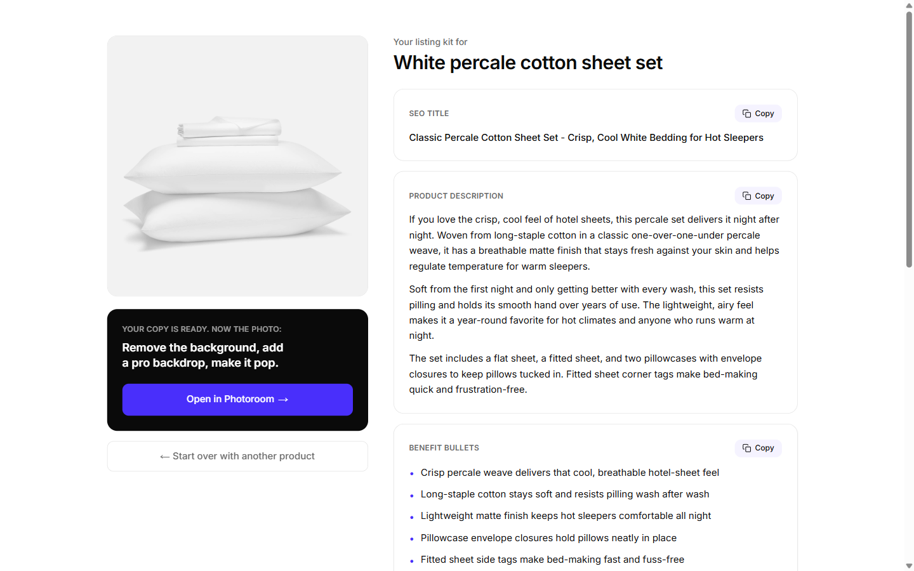

# ListingRoom

Free web tool for e-commerce sellers: turn one product photo (or a product page URL) into a ready-to-paste listing kit in seconds.

Live: **[listingroom.pablo.ky](https://listingroom.pablo.ky)**



## What it does

Give ListingRoom a product and it writes the whole listing for you:

- **SEO title** (keyword front-loaded, 60-80 chars)
- **Product description** (2-3 tight paragraphs)
- **5 benefit bullets**
- **3 ad copy variants** (different angles)
- **1 social caption**
- **10-15 keywords** buyers actually search

Two ways in:

- **Upload a photo.** Drag in a JPEG, PNG, WebP or GIF.
- **Paste a URL.** Drop a product page link and ListingRoom pulls the image and existing copy for you.

The result page has a single CTA: **Open in Photoroom**. The words are the free hook, the visual is the natural next step.

## How it works

The whole thing is one page, one API route, one Claude call.

- **One Claude call** to `claude-opus-4-8` with vision and a JSON schema response. The model reads the actual photo, so the copy describes the real product and never invents specs it cannot see. Structured outputs guarantee a parseable kit, every time.
- **URL mode** tries Shopify's public `/products/<handle>.json` first, then falls back to Open Graph tags. Stores that block server requests (Amazon, Etsy) fail gracefully with a one-tap fallback to photo upload.
- **SSRF-guarded.** Private hosts and resolved private IPs are blocked, and scraped image URLs are re-validated before download.
- **Abuse protection.** In-memory rate limit (10 generations per hour per IP), 5MB image cap, jpeg/png/webp/gif only.

Deliberately **not** here: no database, no auth, no analytics, no tracking. The product is the output, not the user data.

## Run it locally

```bash
npm install
cp .env.example .env.local   # add your ANTHROPIC_API_KEY
npm run dev                  # http://localhost:3000
```

Run the test suite:

```bash
npm test
```

Stack: Next.js 14 (App Router), TypeScript, Tailwind.

## Run with Docker

```bash
docker compose up --build    # reads .env.local, serves on :3000
```

## Why this exists

I built ListingRoom in one day as a growth-marketing portfolio piece for Photoroom. The thesis is simple: a free, genuinely useful word-tool is a low-friction top of funnel. Sellers come for copy they would otherwise pay for, finish with a product photo that obviously needs cleaning up, and hand off into Photoroom to do it: a free hook that loops into a visual handoff and a natural referral. Phase-two levers are obvious without overpromising: programmatic SEO category pages to compound the organic surface, funnel analytics to measure the handoff, and a scraping API to cover Amazon and Etsy URLs that block direct requests. The design language intentionally echoes Photoroom (ink `#0A0A0A`, accent `#492FFB`, Inter, generous whitespace), extracted from photoroom.com.

Made with ♥ for Photoroom by Pablo Sánchez. Not affiliated with Photoroom.
